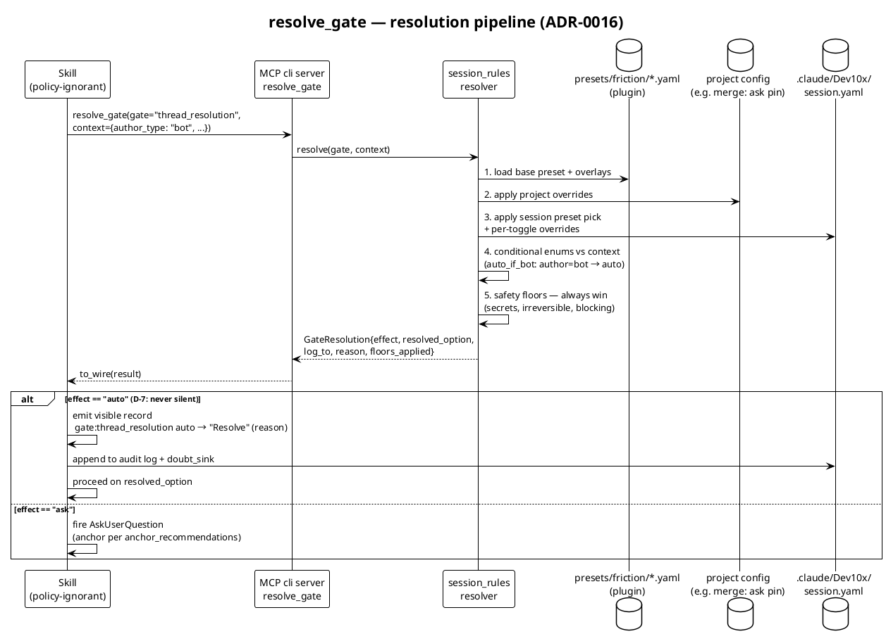

# ADR-0016: Friction Gate Policy — Presets over Toggles with a Resolver Tool

- **Status:** Proposed
- **Date:** 2026-07-03
- **Roots:** GH-742, GH-743, GH-744, GH-745 (skill-audit 2026-07-01)
- **Supersedes (partially):** the three-level `friction_level` contract in
  [ADR-0002](0002-data-driven-skill-redirect-with-friction-levels.md) and the
  gate-flipping-mode exception in
  [ADR-0014](0014-auto-plan-mode-for-plan-approval-gate.md)

## Context

Four audit issues from a single week converged on the same defect: the
autonomy/gating model is too coarse, and its levers are entangled.

- **GH-742** — a stale `session.yaml` carrying `solo_maintainer: true`
  was silently adopted by a new invocation and auto-merged PR #740 with
  no human review. There is no named setting between "full autonomy
  including merge" and "every gate fires".
- **GH-743** — `Dev10x:afk` hard-codes `active_modes: [solo-maintainer]`
  as its walk-away invariant, conflating "run autonomously" with "merge
  autonomously"; it appends modes instead of reconciling them; and
  friction settings are too coarse to express "trust the plan, keep
  working, don't merge".
- **GH-744** — `walk_away` (gate suppression) and `solo-maintainer`
  (reviewer/merge structure) are orthogonal but coupled in the afk
  skill; no warning fires when oversight modes coexist with adaptive.
- **GH-745** — auto-advance cannot key on review-comment **author
  type**: bot-authored threads (safe to handle autonomously) and
  human-authored threads (a trust/social act requiring supervisor
  sign-off) are treated identically. Batch gates block even when a
  batch produces zero VALID fixups.

A three-agent sweep enumerated **~75 documented decision gates across
40+ skills** (explicit `AskUserQuestion` calls plus implicit
preview/confirm pauses). They collapse into 18 gate classes. Today each
skill reads `friction_level` + `active_modes` + `walk_away` and
re-derives gate behavior in prose, producing drift (three separate
documents define precedence), unreachable postures (AFK-without-merge),
and stale-file hazards.

The current model's levers:

| Layer | Controls |
|-------|----------|
| `friction_level` (strict/guided/adaptive) | how a fired gate resolves |
| `active_modes` (structural + 2 gate-flipping exceptions) | what steps exist |
| `walk_away` + `doubt_sink` | whether non-destructive gates fire at all |

A DDD workshop (2026-07-03) modeled the domain and the supervisor
directed the design through eight decisions (D-1..D-8 below), amended
the same day with D-9 (guided-preset relaxation + effect rename,
GH-748).

## Decision

### D-1: `friction_level` becomes a policy preset

The three levels survive as **shipped presets** — named value-maps over
fine-grained toggles — not as a special enum skills branch on. Users
can define additional presets.

### D-2: Skills are policy-ignorant; a resolver tool answers per gate

Skills never read `friction_level`, `active_modes`, or `walk_away`.
At each decision gate the skill calls one MCP tool:

```
mcp__plugin_Dev10x_cli__resolve_gate(
    gate="thread_resolution",
    context={"author_type": "bot", "destructive": false,
             "overlap_signals": 2, "confidence": 85,
             "valid_fixup_count": 0})
→ {"effect": "auto-advance",          # ask | auto-advance | skip
   "resolved_option": "Recommended",
   "log_to": "pr-description",
   "reason": "preset:adaptive thread_resolution=auto-advance-if-bot author=bot",
   "floors_applied": []}
```

Domain logic lives in `dev10x.domain.session_rules` (which already
centralizes `plan_gate_auto_approves()` and
`completion_gate_recommendation()` — both become internal to the
resolver). The MCP boundary routes through `to_wire()` per ADR-0009.



### D-3: Toggles are typed — bool, enum, weight

22 toggles derived from the gate inventory. Effects vocabulary (D-6,
renamed by D-9): `ask` (fire, block) / `auto-advance` (resolve to
recommended, never block — the name every skill's orchestration
contract already uses) / `skip` (structural removal). Conditional
auto-advances: `auto-advance-if-bot`, `auto-advance-if-safe`,
`auto-advance-if-merged`, `auto-advance-if-stale-free`. Weights are
numeric thresholds feeding the conditional auto-advances.

| Toggle | Type | Values |
|---|---|---|
| `plan_approval` | enum | ask / auto-advance |
| `batch_layout` | enum | ask / auto-advance (weight-conditioned) |
| `strategy_choice` | enum | ask / auto-advance |
| `artifact_preview` | enum | ask / auto-advance |
| `triage_response` | enum | ask / auto-advance-if-bot / auto-advance |
| `thread_resolution` | enum | ask / auto-advance-if-bot / auto-advance |
| `comment_hide` | enum | ask / auto-advance |
| `yagni_routing` | enum | ask / auto-advance |
| `shipping_continuation` | enum | ask / auto-advance |
| `request_review` | enum | ask / auto-advance / skip |
| `external_notify` | enum | ask / auto-advance / skip |
| `merge` | enum | ask / auto-advance |
| `completion_signoff` | enum | ask / auto-advance |
| `history_rewrite` | enum | ask / auto-advance-if-safe / auto-advance |
| `workspace_choice` | enum | ask / auto-advance |
| `branch_cleanup` | enum | ask / auto-advance-if-merged / auto-advance (D-5) |
| `session_adoption` | enum | ask / auto-advance-if-stale-free / auto-advance |
| `zero_valid_autoflow` | bool | batch gates auto-advance on zero VALID fixups |
| `autofix_confidence` | weight | 0–100; review-fix auto-sends findings ≥ threshold |
| `batch_ambiguity_floor` | weight | min overlap signals to auto-accept a batch |
| `doubt_sink` | enum | pr-description / session-bookmark / commit-footer |
| `anchor_recommendations` | bool | show "(Recommended)" anchoring in ask widgets |

`auto-advance-if-bot` encodes the GH-745 author-type rule: bot-authored threads
resolve autonomously; human-authored threads escalate to `ask`
regardless of preset.

### D-4: Per-toggle session override

Any single toggle can be overridden for the current session without
changing the preset. Resolution order (lowest to highest):

```
plugin preset < project override < session preset choice
             < per-toggle session override < safety floors
```

### D-5: Reversibility decides floor vs toggle

Reversibility is tri-state (trivial / assisted / none). Only
*none*-tier operations are floors. Branch deletion is
assisted-recoverable (reflog) → the `branch_cleanup` toggle with
`auto-advance-if-merged` (auto-delete only branches whose tips are reachable
from base). Mass delete of untracked files, worktree removal holding
uncommitted work → floors.

### D-6: Two effects; anchoring is display, not effect

`recommend` is eliminated: today's strict-vs-guided difference is
anchoring bias in the widget, not behavior. `anchor_recommendations`
(bool, preset-level) captures it honestly.

### D-7: `auto-advance` is never silent

Every auto-resolution MUST surface a visible one-line record in the
session transcript — `⚙ gate:<toggle> auto-advance → "<option>" (<reason>)` —
so a present supervisor can notice and override mid-flight, AND append
to the audit log + `doubt_sink`. An auto-resolution without a visible
record is a compliance bug (extends walk-away.md's silent-suppression
anti-pattern to the whole resolver).

### D-8: Merge auto-advances at adaptive; the human boundary lives at the project tier

`adaptive` IS the walk-away autonomy posture, merges included. The
team-repo human boundary is a **project-tier concern**: a team-reviewed
repo pins `merge: ask` (and typically `external_notify: ask`) in its
project config. Because project overrides outrank the preset, adaptive
sessions on that repo still stop for a human merge while solo repos
merge autonomously. Repo character (solo vs team) is a durable property
of the repo — encoding it per-project kills the GH-743/744 failure mode
at the right layer, and a stale session file can no longer cross the
boundary (D-8 composes with `session_adoption: auto-advance-if-stale-free`,
which re-prompts when `session.yaml` mismatches the current
invocation — GH-742 F1).

### D-9: Guided is light-AFK — auto-advance through self-review, supervised team interactions (GH-748)

Amendment (2026-07-03, supervisor-directed). The original guided
column fired every gate, differing from strict only by anchoring,
weights, and stale-session trust. That wasted an attended-but-busy
supervisor's time on repeatable mechanical choices. New posture:

- **Guided auto-advances the mechanical pipeline through
  self-review** — plan approval, batches, strategies, artifact
  previews, bot-thread handling, groom-if-safe, cleanup-if-merged,
  zero-VALID flow.
- **Team interactions stay supervised.** `request_review` fires its
  widget: the agent *reaches* the step, the supervisor decides — with
  a **Stand by** option so they can run a self-review pass before
  reviewers are pinged. `external_notify` and `completion_signoff`
  also ask.
- **The merge is a strictly human action through the PR UI** —
  `merge: skip`: the agent's merge step does not exist at guided. The
  session hands off after request-review, or monitors waiting for a
  teammate's approval (the completion gate's Monitor-for-review path).
- **Effect rename:** `auto` → `auto-advance` (and conditional values
  accordingly), aligning the resolver vocabulary with the
  "Auto-advance" contract line every skill already carries.

Net ladder: guided = adaptive except `request_review` (widget with
stand-by), `merge` (skip vs auto-advance), and `completion_signoff`
(ask vs auto-advance).

### Shipped presets

| Toggle | strict | guided | adaptive |
|---|---|---|---|
| plan_approval | ask | auto-advance | auto-advance |
| batch_layout | ask | auto-advance | auto-advance |
| strategy_choice | ask | auto-advance | auto-advance |
| artifact_preview | ask | auto-advance | auto-advance |
| triage_response | ask | auto-advance-if-bot | auto-advance-if-bot |
| thread_resolution | ask | auto-advance-if-bot | auto-advance-if-bot |
| comment_hide | ask | auto-advance | auto-advance |
| yagni_routing | ask | auto-advance | auto-advance |
| shipping_continuation | ask | auto-advance | auto-advance |
| request_review | ask | ask (widget w/ stand-by) | auto-advance |
| external_notify | ask | ask | ask |
| merge | ask | **skip** (human via PR UI) | auto-advance |
| completion_signoff | ask | ask | auto-advance |
| history_rewrite | ask | auto-advance-if-safe | auto-advance-if-safe |
| workspace_choice | ask | auto-advance | auto-advance |
| branch_cleanup | ask | auto-advance-if-merged | auto-advance-if-merged |
| session_adoption | ask | auto-advance-if-stale-free | auto-advance-if-stale-free |
| zero_valid_autoflow | 0 | 1 | 1 |
| autofix_confidence | 101 (never) | 70 | 70 |
| batch_ambiguity_floor | ∞ (always ask) | 3 | 3 |
| anchor_recommendations | false | true | true |

Overlay presets (patches on a base): `solo-maintainer`
(request_review: skip, external_notify: skip, merge: auto-advance at
any base) and `afk` (session_adoption: auto-advance, external_notify
queued to doubt_sink, doubt_sink: pr-description). The afk skill
composes presets instead of appending `solo-maintainer` to
`active_modes` (GH-743 F1, GH-744 F2); conflicting oversight
configuration is reconciled by preset replacement.

### Safety floors (deny-overrides)

The resolver returns `ask` regardless of preset or override for gates
with no blind-pickable safe default:

- **Secret access** — aws-vault retrieval incl. read-only lookups
- **Destructive-irreversible** (reversibility: none) — force-push to
  protected branches; mass delete of untracked files; worktree removal
  holding uncommitted work
- **Cross-author pushes** — courtesy-fixup to another author's branch
- **Privacy disclosure** — unfictionalizable audit findings
- **Blocking class** — missing credentials / MCP unreachable;
  unresolved merge or directive conflicts; BLOCKED-item escalations;
  gh-pr-merge override gates (merge despite infra-red CI,
  admin-override a review block)

## Alternatives Considered

1. **Single named mode (`afk-autonomous`) added to `active_modes`** —
   least churn; but leaves the human boundary and author-type keying
   implicit/hardcoded, does not deliver GH-743 F3's per-gate
   granularity, and each skill still re-derives gate behavior from
   prose. Rejected: treats the symptom, not the entanglement.
2. **Keep three-level friction, add carve-outs per audit finding** —
   the status quo trajectory (GH-252, GH-678, GH-808 each added a
   carve-out). The precedence prose already spans three documents and
   contradicts itself at the plan gate. Rejected: carve-out debt grows
   per audit.
3. **Per-gate-class policy WITHOUT a resolver tool** (skills read the
   toggle map themselves) — same taxonomy, but every skill re-implements
   resolution order, floors, and logging; drift returns within a few
   releases. Rejected: the tool is what makes skills policy-ignorant
   and the contract testable in one place.
4. **Three effects (ask / notify / auto-advance)** with `notify` =
   fire-and-proceed (widget emitted, agent proceeds on recommended if
   not overridden) — genuinely distinct middle ground with precedent in
   the plan gate at adaptive; deferred, not adopted: D-7's visible
   auto-records cover the "supervisor can notice and override" need
   with less harness complexity. Revisit if auto-records prove too easy
   to miss.

## Consequences

**Easier:**
- "AFK but don't merge on team repos" is expressible and durable
  (project tier), closing GH-742 F2, GH-743 F1/F3, GH-744 F2.
- Bot/human author keying is first-class (GH-745 F4);
  zero-VALID batches auto-flow (GH-745 F1).
- One resolution pipeline, one precedence order, unit-testable; the
  scattered prose rules (walk-away flowchart, plan-gate matrix,
  adaptive carve-outs) collapse into `session_rules`.
- Skill migration shrinks skill docs: `ALWAYS_ASK` markers become
  floors in the resolver, not repeated prose.
- Every autonomous decision is visible and auditable (D-7).

**Harder / risks:**
- Migration touches every gate-emitting skill (~40). Mitigated by
  phased rollout (below) — the resolver defaults to current behavior
  for unmigrated skills, which keep reading session.yaml until
  converted.
- A per-gate MCP call adds latency at each gate. Mitigated: resolution
  is a pure in-process lookup behind a long-lived server (~ms), and
  gates are seconds-scale interactions.
- `session.yaml` schema changes (preset + toggle overrides replace
  friction_level/active_modes/walk_away). Mitigated by 1:1 legacy
  mapping (`adaptive` → preset adaptive; `solo-maintainer` → overlay;
  `walk_away: true` → afk overlay) read-compatible in the resolver.
- Two knob surfaces during transition (modes for structural behavior,
  toggles for gates). `active_modes` remains for purely structural
  modes (`review-deferred`, `swarm-child`); the gate-flipping
  exceptions (`solo-maintainer`, `auto-plan`) migrate into overlays,
  retiring ADR-0014's exception.

## Implementation Plan

Phase 1 (this PR, spike): `dev10x/domain/session_rules.py` —
`resolve_gate()` pipeline (preset → overlay → session override →
conditional-context → floors), preset definitions, legacy
session.yaml mapping; unit tests replaying the four audit scenarios
(stale-config auto-merge, bot-vs-human thread, team-repo project pin,
zero-VALID batch). MCP tool `resolve_gate` on the `cli` server via
`to_wire()`; row added to `.claude/rules/mcp-tools.md`.

Phase 2: migrate gate-heavy skills — work-on (plan/batch/strategy/
completion), gh-pr-respond (G1–G7), gh-pr-merge, git-commit,
gh-pr-monitor — replacing session.yaml reads with `resolve_gate` calls.
Rewrite `Dev10x:afk` as preset composition.

Phase 3: long-tail skills; update `references/friction-levels.md`,
`references/execution-modes.md`, `references/walk-away.md`,
`references/active-modes.md` to defer to the resolver; deprecate
`walk_away` key.

Phase 4: close GH-742/743/744/745 findings not already covered
(gh-pr-respond merge-state preamble GH-744 F1, `check_top_level_comments`
broadening GH-743 F2, git-commit unattended detection GH-745 F2 —
mechanical fixes reshaped to consume the resolver).

## Open Questions (resolved defaults)

- **Unknown author type** → treated as `human` (safe direction).
- **Preset files** → plugin ships `presets/friction/*.yaml`; user
  presets in `~/.config/Dev10x/friction-presets.yaml`; session pick +
  per-toggle overrides in `.claude/Dev10x/session.yaml`.

## References

- Workshop artifact: DDD session 2026-07-03 (D-1..D-8), gate inventory
  sweeps (75 gates, 18 classes)
- GH-742, GH-743, GH-744, GH-745 — audit-2026-07-01 findings
- ADR-0002 (friction levels), ADR-0009 (Result contract at MCP
  boundary), ADR-0014 (auto-plan mode — exception retired by this ADR)
- Cedar policy language (permit/forbid + deny-overrides) — floor
  semantics inspiration, per the GH-271 PAP scoping
