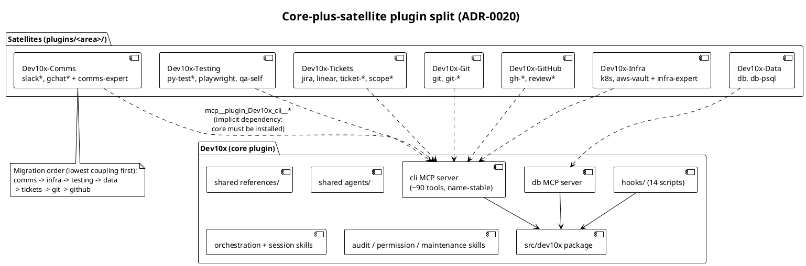

# 20. Core-plus-satellite plugin split by application area

Date: 2026-08-04

## Status

Rejected (2026-08-04)

### Rejection rationale

A full dependency scan of all 87 skills (same day, GH-913) falsified
the split's premise:

1. **The areas are not separable.** The `work-on` transitive closure
   spans 32 skills across git, github, tickets, comms, and testing —
   hard `Skill()` delegation edges (`gh-pr-monitor →
   slack-review-request`, `gh-pr-fixup → py-test`, `gh-pr-respond →
   ticket-create`, …) make five of the seven planned satellites one
   inseparable shipping machine.
2. **Only 4 skills are cleanly severable** — infra (`k8s`,
   `aws-vault`) and data (`db`, `db-psql`) have zero kernel edges.
   Two 2-skill satellites do not justify multi-plugin repo layout,
   release tooling, and doctor-check overhead.
3. **A zero-local-code ("web-only") edition of unchanged skills is
   not viable:** 2/87 skills qualify (`session-tasks`,
   `skill-audit-queue`).

Light-audience needs (e.g., a business user shipping small UI
changes as PRs) are served by a playbook + gate preset over the
existing single plugin — a profile, not a package. The unified
plugin stands. No implementation phases below were executed beyond
this ADR itself.

## Context

GH-913 asks to split the unified `Dev10x` plugin into multiple plugins
by application area, each shipping its skills, scripts, and an area
expert agent. The repo was deliberately consolidated from 11 plugin
directories into one unified plugin; this ADR defines how to reverse
that at the *distribution* layer without reversing it at the
*infrastructure* layer.

### Current State

- One plugin (`Dev10x`, `.claude-plugin/plugin.json`) shipping 87
  skill directories, 21 agent specs, 14 hook scripts, and two MCP
  servers (`cli` with ~90 tools, `db`).
- `.claude-plugin/marketplace.json` lists exactly one plugin with
  `source: "./"`.
- Every user installs all 87 skills regardless of which application
  areas they use; the skill index and MOTD carry the full catalog.

### Problems

1. Users cannot install per application area — a database-only or
   comms-only user still gets the full 87-skill catalog.
2. The single skill namespace (`Dev10x:*`) mixes unrelated areas,
   inflating skill-selection context for every session.
3. The plugin description self-reports stale counts ("69 skills" vs
   87 on disk) — a symptom of one manifest owning too much surface.
4. Area expertise (e.g., PR lifecycle vs database) has no packaging
   boundary, so an "expert with scripts" per area (GH-913) has no
   home.

### Coupling constraints (measured)

1. 50/87 skills invoke `mcp__plugin_Dev10x_cli__*` /
   `mcp__plugin_Dev10x_db__*` tools. The plugin name is baked into
   the MCP tool-name prefix, so moving the *servers* to a
   differently-named plugin renames ~90 tools across 50 skills.
2. 13/14 hook scripts import the `dev10x` Python package — the
   safety hooks require the full `src/dev10x` tree wherever they
   ship.
3. 37/87 skills reference `${CLAUDE_PLUGIN_ROOT}`; those reaching
   into the *shared* top-level `references/` break when moved to a
   different plugin root.
4. Skill invocation names (`Dev10x:slack`, `Dev10x:git-commit`, …)
   are hardcoded in other skills, playbooks, and user configs; the
   plugin prefix changes when a skill moves.

### Prerequisites

- ADR-0006 (internal GitHub MCP server is the sole GitHub surface)
  — unchanged; the `cli` server stays where its name is preserved.
- ADR-0018 (session state lives outside the repo `.claude/` tree)
  — unchanged; satellites write nothing under any repo `.claude/`.

## Decision

We will keep `Dev10x` as the **core plugin** — owning both MCP
servers, all hooks, the `src/dev10x` package, shared `references/`,
and shared `agents/` — and split *skill families* into **satellite
plugins by application area**, hosted in the same repo and published
through the same marketplace.

### Architecture

**Core plugin `Dev10x` retains:**

| Component | Why it stays |
|-----------|--------------|
| `servers/` + `src/dev10x/mcp/` | Preserves the `mcp__plugin_Dev10x_cli__*` / `db` tool prefix that 50 skills hardcode — zero tool renames |
| `hooks/` + `src/dev10x/` | 13/14 hook scripts import `dev10x`; safety hooks are global, not per-area |
| shared `references/`, `agents/` | Cross-area dependencies (orchestration patterns, review guides, reviewer/architect agents) |
| Orchestration & session skills (work-on, fanout, foreman, park*, session-*, playbook*, afk, plan-sync, ask) | Inseparable from hooks, gate policy, and session state |
| Audit / permission / plugin-maintenance skills | Operate on the core's own hook and permission machinery |

**Satellite plugins** (same repo, `plugins/<dir>/`, one
marketplace entry each) ship their area's skills with scripts, an
area expert agent, and area-local references:

| Satellite | Skills (from current tree) |
|-----------|---------------------------|
| `Dev10x-Comms` | slack, slack-setup, slack-review-request, gchat, gchat-review-request |
| `Dev10x-Infra` | k8s, aws-vault |
| `Dev10x-Testing` | py-test, py-test-flaky, py-uv, playwright, qa-self |
| `Dev10x-Data` | db, db-psql |
| `Dev10x-Tickets` | jira, linear, ticket-*, scope, project-scope, qa-scope |
| `Dev10x-Git` | git, git-* (9 skills) |
| `Dev10x-GitHub` | gh-*, review, review-fix, request-review (15 skills) |

Release, ADR/DDD, and remaining misc skills are assigned during
scoping (follow-up sub-issues), defaulting to core until moved.

### Key rules

1. **Satellites depend on core.** MCP tool names are session-global,
   so a satellite skill calling `mcp__plugin_Dev10x_cli__*` works as
   long as core is installed. This dependency is implicit in Claude
   Code today; `plugin-doctor` gains a check that reports satellites
   installed without core.
2. **Invocation names move with the plugin.** `Dev10x:slack` becomes
   `Dev10x-Comms:slack`. Each area-move PR includes the full
   cross-reference sweep (skills, playbooks, docs, command-skill
   map). No alias/compatibility layer (YAGNI) — the sweep is
   mechanical and CI-verifiable.
3. **Migration is per-area, lowest coupling first:** comms → infra →
   testing → data → tickets → git → github. Each move is one PR that
   leaves the marketplace releasable.
4. **Refactoring mechanics:** `git mv` for directory moves (history
   preservation); JetBrains MCP tooling (`mcp__pycharm__search_regex`,
   `rename_refactoring`, `apply_patch`) for symbol-aware reference
   sweeps across SKILL.md, playbooks, and Python.

### New Components

| Component | Location | Responsibility |
|-----------|----------|----------------|
| Satellite manifests | `plugins/<dir>/.claude-plugin/plugin.json` | Per-area plugin identity and versioning |
| Area expert agents | `plugins/<dir>/agents/<area>-expert.md` | Area-specific expertise shipped with the satellite (GH-913) |
| Core-dependency check | `src/dev10x/skills/doctor/` | Detect satellite-without-core installs |

### Dependencies (Reused Components)

| Component | Location | How We Use It |
|-----------|----------|---------------|
| `cli` / `db` MCP servers | `servers/`, `src/dev10x/mcp/` | Unchanged; satellites call tools by existing names |
| Hook chain | `hooks/hooks.json` | Unchanged; core-only |
| Marketplace | `.claude-plugin/marketplace.json` | Gains one entry per satellite |

## Alternatives Considered

### Alternative 1: Keep the unified plugin (status quo)

**Pros:**
- Zero migration cost or breakage risk
- Single version, single release pipeline

**Cons:**
- Per-area installation remains impossible
- Skill catalog and namespace keep growing unbounded

**Verdict:** Rejected — does not deliver GH-913's requirement.

### Alternative 2: Full symmetric split (servers, hooks, and package split per plugin)

Every satellite ships its own MCP server slice and hook subset.

**Pros:**
- Fully self-contained satellites, no implicit dependency

**Cons:**
- Renames ~90 MCP tools across 50 skills (prefix carries the
  plugin name) — massive, error-prone sweep
- 13/14 hooks import `dev10x`; splitting the package duplicates it
  or fractures the safety chain
- One MCP daemon per satellite multiplies process overhead

**Verdict:** Rejected — the tool-name prefix and hook coupling make
this a high-risk rewrite, not a repackaging.

### Alternative 3: Core + satellites (selected)

**Pros:**
- Zero MCP tool renames; hooks and safety chain untouched
- Incremental, per-area PRs; each step releasable
- Satellites are thin (skills + agent + references) — low-risk moves

**Cons:**
- Implicit satellite→core dependency (no native mechanism)
- Invocation-name sweeps required per moved area

**Verdict:** Selected

## Consequences

### What Becomes Easier

1. Per-area installation and a leaner default skill catalog.
2. Area expert agents have a natural packaging home.
3. Plugin descriptions/counts stay honest per area.

### What Becomes More Difficult

1. Release tooling must version and package multiple plugins from
   one repo.
2. Cross-plugin skill delegation must name the right prefix; sweeps
   accompany every move.
3. Docs/onboarding must explain the core-first install order.

### Risks and Mitigations

| Risk | Likelihood | Impact | Mitigation |
|------|------------|--------|------------|
| Satellite installed without core → MCP tools missing | Medium | High | plugin-doctor core-dependency check; install docs |
| Missed invocation-name reference after a move | Medium | Medium | JetBrains-MCP regex sweep + cli-friction scanner in CI per move PR |
| Release pipeline breaks on multi-plugin layout | Medium | High | Dedicated tooling sub-issue lands before the first area move |
| User configs (playbooks, friction.yaml) reference old names | High | Low | Release notes per move; upgrade-cleanup migration step |

## Implementation Plan

Tracked as a GH-913 milestone; one sub-issue per phase.

### Phase 1: Foundations (before any move)

1. This ADR (`docs/adr/0020-core-plus-satellite-plugin-split.md`).
2. Multi-plugin repo layout: `plugins/` scaffolding, marketplace
   entries, `claude plugin validate` CI per plugin.
3. Release tooling: per-plugin versioning/packaging in `bin/` and
   `skills/release`.
4. plugin-doctor core-dependency check.

### Phase 2: Pilot move — Dev10x-Comms

1. `git mv skills/{slack,slack-setup,slack-review-request,gchat,gchat-review-request}`
   → `plugins/comms/skills/`.
2. Author `plugins/comms/agents/comms-expert.md`.
3. JetBrains-MCP sweep of `Dev10x:slack*` / `Dev10x:gchat*`
   references (skills, playbooks, docs, command-skill-map).
4. Validate install + invocation end-to-end; document lessons.

### Phase 3+: Remaining areas

One sub-issue per area in coupling order: infra → testing → data →
tickets → git → github. Each repeats the Phase 2 pattern.

## References

### External Documentation

- [Claude Code plugin marketplaces](https://code.claude.com/docs/en/plugin-marketplaces)

### Internal References

- [ADR-0006 — internal GitHub MCP server](0006-keep-internal-github-mcp-over-official-server.md)
- [ADR-0018 — session state outside the repo tree](0018-session-state-relocates-out-of-project-claude-tree.md)
- [GH-913](https://github.com/Dev10x-Guru/dev10x-claude/issues/913)
