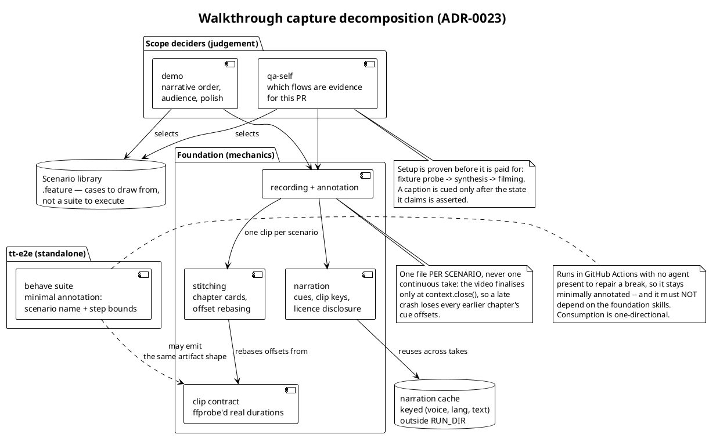

# 23. Walkthrough capture is per-scenario, setup-first, and tiered by who can repair a break

Date: 2026-09-08

## Status

Accepted

Records the supervisor decision to write an ADR rather than a committed
spec for the walkthrough redesign. Builds on the QA-M1 wave
([#1229](https://github.com/Dev10x-Guru/Dev10x-Claude/issues/1229)–[#1233](https://github.com/Dev10x-Guru/Dev10x-Claude/issues/1233),
PR [#1234](https://github.com/Dev10x-Guru/Dev10x-Claude/pull/1234)),
whose findings shared one shape: a check that fails silently or in the
wrong direction, so the session reads a guaranteed failure as its own
mistake. This ADR carries that lens into the architecture.

Implementation is tracked as QA-M2:
[#1236](https://github.com/Dev10x-Guru/Dev10x-Claude/issues/1236),
[#1237](https://github.com/Dev10x-Guru/Dev10x-Claude/issues/1237),
[#1238](https://github.com/Dev10x-Guru/Dev10x-Claude/issues/1238),
[#1239](https://github.com/Dev10x-Guru/Dev10x-Claude/issues/1239),
[#1240](https://github.com/Dev10x-Guru/Dev10x-Claude/issues/1240).

## Context

`Dev10x:qa-self` grew a narrated-walkthrough capability incrementally:
recording, annotation, narration, TTS routing, stitching and evidence
verification all landed inside one skill aimed at one job (QA evidence
for a PR). Demo and release-note video then reused the same machinery
with different requirements, and the e2e suite in `tt-e2e` covers many
of the same journeys with none of the annotation.

The instinct when redesigning this is that the value and the risk both
live in the video pipeline — chapters, stitching, offset arithmetic.
**The evidence says otherwise**, and it is unusually direct: three
independent sessions on 2026-09-08 reported the same cost distribution.

- One session lost **six consecutive takes, all in fixture setup**. None
  failed in recording, narration, stitching or TTS.
- A second ran **thirteen takes** of a six-chapter `tt-dealeradmin`
  walkthrough as one continuous recording. Chapters 1–5 eventually
  worked; chapter 6 never did. Every retry re-paid ~3 min of synthesis
  plus ~3 min of fixture rebuild before the browser reached the step
  under debug. Two of the thirteen failures were regressions the session
  introduced between takes.
- A third re-verified the QA-M1 fixes and found a related defect class
  still live in sibling skills
  ([#1235](https://github.com/Dev10x-Guru/Dev10x-Claude/issues/1235)).

Three failures from that second session set the shape of this document:

1. **A late failure destroys everything earlier.** The video is
   finalised only when the browser context closes. A crash in the last
   chapter means `context.close()` never runs on the happy path and
   `narration.write_manifest()` never runs, so the cue offsets die with
   the process. The session was left with a good 4:05 recording of
   chapters 1–5 that is **silent**, beside 35 synthesised `.wav` files
   it can no longer place on a timeline.
2. **Even when the footage survives, the boundaries do not.** Salvaging
   those chapters meant binary-searching extracted frames to find the
   chapter-6 boundary — `chapter_lines()` offsets exist only if the run
   completes, and `anno.step()`'s chapter chip is part of a per-document
   overlay that is cleared at every `goto`, so the finished file has
   nothing to search for. Three re-encodes and five frame extractions to
   place one cut, chosen by eye.
3. **A caption can assert something the footage disproves.** A service
   holding a part plus its labour renders as two estimate lines but
   collapses into **one row** in the authorization dialog, so a script
   written to approve one and decline the other declined the only row.
   The finished video shows `0 approved / 1 declined` and `$0.00` while
   the narration announces that the approved work is now a job the shop
   can start. It passed `verify-evidence.py` cleanly — real file size,
   real stddev, no padding. Only reading the frame caught it.

The third is the QA-M1 failure shape arriving at the last unguarded
layer, and it is the only one whose output is a *published artifact
asserting something untrue*.

## Decision

### D-1. Three skills, split by who decides scope

Per the supervisor: *"there should be a foundation skill for
walkthroughs, video stitching, and separate qa and demo skills that will
decide on the actual scope."*

| Skill | Owns | Does not own |
|---|---|---|
| foundation (walkthrough + stitching) | recording, annotation, narration, the clip contract, stitching | which journeys to film, how richly to annotate |
| `qa-self` | QA scope: which flows are evidence for this PR, what the reviewer must see | the capture mechanics |
| demo | demo scope: narrative order, audience, polish | the capture mechanics |

Scope selection is the thing that differs between QA and demo; capture
mechanics are the thing that does not. Splitting on that seam is what
stops demo requirements leaking into an evidence pipeline.

### D-2. `.feature` files are a library, not a suite

Scenarios are **a library of possible cases to draw from**, not a fixed
set to execute. Exploratory testing is first-class here, not an
afterthought — as the supervisor put it, *"only a deployed preview app
or staging or qa env can help discover all test scenarios that should be
covered."* A walkthrough selects from the library; discovering a new
case adds to it.

Gherkin is the right notation and DocStrings are first-class grammar,
not fragile parsing. One trap belongs in the contract: DocStrings arrive
as `context.text`, and `context.execute_steps()` does **not** forward
it, so a wrapper step that delegates to a callee reading `context.text`
silently sees the caller's value or `None`. (`tt-e2e` runs **behave**,
not `pytest-bdd`.)

### D-3. Capture per scenario, never one continuous take

Each scenario records to its own file. This is the highest-leverage
decision in this document, and it is a **failure-containment** decision
before it is a cost decision:

- A crash discards one clip instead of the whole run. Passing scenarios
  are banked complete with their audio and offsets.
- A false claim is one discardable clip rather than something welded
  into the middle of an otherwise good recording.
- Chapter boundaries come free from file boundaries, so trimming never
  needs frame forensics.
- A retry re-runs one scenario.

Chapter cards are stitched between clips rather than stamped into the
footage, since an in-page chip cannot survive navigation anyway.

### D-4. The clip contract rebases offsets from measured durations

Stitching rebases each clip's cue offsets using **`ffprobe`'d real
durations**, never declared ones. Declared durations drift from
encoder output and the error compounds across concatenation.

This is the technical centre of gravity for stitching — and a
solved-shape problem. It is deliberately **not** where this redesign
spends its risk budget.

### D-5. Annotation richness is a function of who can repair a break

The tier is set by *who is present when it fails*, not by how important
the output looks.

| Context | Repairer | Annotation |
|---|---|---|
| `tt-e2e` in GitHub Actions | nobody — no agent to diagnose | minimal: scenario name, step boundaries |
| walkthrough video | an agent, then a human reviewer | rich: captions, narration, pointers |

So `tt-e2e` **stays standalone**. It must not depend on the Dev10x
walkthrough skills; the relationship is at most a shared artifact
contract, consumed in one direction. Its own recording path is filed as
`tiretutorinc/tt-e2e#444`. A walkthrough video may break precisely so an
agent can discover and fix it; a CI suite may not.

### D-6. Setup is proven before it is paid for, and setup steps converge

Two rules, both aimed at where the takes actually died:

- **Probe before synthesis.** A cheap fixture probe must succeed before
  synthesis runs (#1238). §2.3a already encourages this; it becomes a
  precondition rather than advice, because nothing currently detects the
  ordering at all — six takes proved that empirically.
- **Setup steps converge** (#1239). A `Given` step asserts its desired
  end state and acts only when that state does not hold. "Already
  correct" is a success. The worked example: a Save bound to
  `react-hook-form`'s `isDirty` is *disabled* when the value already
  holds, so a blind click on a re-run burns a 30s timeout — a step
  correct on a clean slate and broken on second pass.

A scenario's `Given` steps construct every entity they depend on rather
than hunting for one. A lookup returning only a create-new affordance is
a **hard failure to surface immediately**, not a retry: one session
burned three takes before concluding a staging customer search returned
nothing for records that demonstrably existed.

Synthesised narration is cached content-addressed on
`(voice, lang, text)` outside the run directory (#1237), so a retry pays
the fixture cost only.

### D-7. A caption must not precede the state it claims

A scripted beat may carry an assertion about the state it describes, and
the assertion is checked **before** the caption is cued (#1240). A
failed assertion aborts the beat and names the mismatch instead of
narrating over it. For transient UI, capture precedes narration —
`shoot()` then `say()` — because a snackbar can auto-dismiss inside the
narration's own dwell.

And plainly: `verify-evidence.py` validates the **artifact**, not the
**claim**. Its silence is not a verdict on truthfulness. Two of these
three published-claim failures passed it.

## Alternatives Considered

**One continuous take with chapter markers in-frame.** Rejected on
evidence (D-3). The markers do not survive navigation, so they cannot be
recovered from the finished file, and the finalisation trap means a late
failure loses the entire run's audio.

**Keep everything in `qa-self` and parameterise it.** Rejected: demo and
QA differ in *scope selection*, which is judgement, not configuration.
Parameterising it puts demo polish requirements inside an evidence
pipeline.

**Extend the walkthrough skills into `tt-e2e`.** Rejected under D-5.
Rich annotation is a liability where no agent can repair a break, and
the coupling would make a CI suite depend on a video toolchain.

**A committed spec instead of an ADR.** Rejected by the supervisor.
Plans and specs are working files and never enter git; a decision record
is the durable form.

**Refuse to publish a non-commercially-licensed voice-over.** Rejected
as policy: licence compliance is the supervisor's call. The toolchain
surfaces terms and attribution — the manifest records `lang` and
`commercial_use_allowed` — and honours the decision (GH-1221).

## Consequences

**Easier.** A failed take costs one scenario. Trimming needs no frame
forensics. Passing scenarios are usable evidence immediately. A false
claim is caught before it is narrated, or discarded as one clip. QA and
demo evolve without fighting over one skill.

**Harder.** Per-scenario capture needs a stitching step that did not
previously exist on the critical path, and chapter cards become an
artifact to design rather than an overlay to draw. Convergent setup
steps are more work to write than first-run-only ones. Assertions on
claims mean scripts carry expectations, not just prose.

**Risks.** Stitched output can drift from per-clip sources if offsets
are rebased from declared rather than measured durations — D-4 exists
to prevent exactly that, and it is the one place to be strict. A shared
narration cache keyed on the wrong tuple would serve the wrong audio;
`lang` is part of the key for that reason, since after GH-1221 the same
text and voice can resolve differently per language.

**Unverified.** One session's thirteen takes never produced its final
chapter, so the "Don't ask" direct-conversion path it was filming
remains unconfirmed by capture — it may be a real product finding or a
selector problem. Recorded here as open, claimed neither way.

## References

- PR [#1234](https://github.com/Dev10x-Guru/Dev10x-Claude/pull/1234) — the QA-M1 wave this follows
- [ADR-0022](0022-single-baseline-gate-model-with-supervisor-review.md) — gate policy baseline
- `skills/qa-self/instructions.md` — §2.3a probe-first, Phase 4.1 verifier/mux split
- `skills/playwright/lib/narration.py` — clip keys, cue offsets, licence disclosure
- `agents/reviewer-e2e.md` — behave targeting, `context.text` trap (item 6)
- [Cucumber Gherkin reference](https://cucumber.io/docs/gherkin/languages/)
