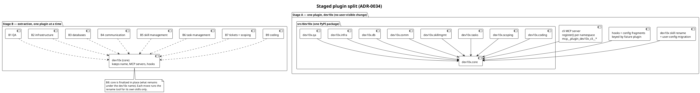

# 34. Staged plugin split: restructure in place, then extract one plugin at a time

Date: 2026-10-10

## Status

Accepted (2026-10-10). Supersedes
[ADR-0020](0020-core-plus-satellite-plugin-split.md), which was rejected
on 2026-08-04.

## Context

The supervisor wants the unified `dev10x` plugin (94 skills) split into
nine plugins by application area (GH-1522). ADR-0020 rejected a nearly
identical split two months ago, because a dependency scan found the
areas inseparable as a *single step*:

- the `work-on` closure spans about 32 skills;
- coding and tickets/scoping invoke each other;
- only four skills were cleanly severable.

This ADR keeps those findings and changes the sequencing, so that no
step ever depends on the split being finished.

### Current State

- One plugin, `dev10x`, with 94 skills, 2 MCP servers (`cli` with about
  90 tools, `db`), 11 hook entries, and one `src/dev10x` package.
- Shared configuration that mixes every area:
  - the permission catalog (`skills/upgrade-cleanup/projects.yaml`);
  - `skills/skill-index/families.yaml`;
  - `src/dev10x/validators/command-skill-map.yaml`;
  - `hooks/hooks.json`.
- The `cli` MCP server runs scripts that live inside coding skill
  folders, such as `gh-context`, `gh-pr-*`, `git-*`, `release-notes`
  and `skill-index`.

### Problems

1. Per-area installation is impossible; every user gets 94 skills.
2. ADR-0020's blockers still apply to a one-shot split:
   - **invocation-name prefix:** `dev10x:<skill>` becomes
     `<plugin>:<skill>` when a skill moves, so every reference in skills,
     playbooks, docs, the command map and user configs must be rewritten;
   - **MCP tool-name prefix:** about 90 `mcp__plugin_dev10x_cli__*`
     names are hardcoded in 50+ skills and permission rules;
   - **hard cross-area `Skill()` edges.**
3. A split that is half-done must not leave users with a broken install.

### Prerequisites

- ADR-0006: the internal GitHub MCP server remains the sole GitHub
  surface.
- ADR-0010: uv-script skills are thin shims over importable modules,
  which makes namespace moves mechanical.
- ADR-0025: `projects.yaml` is the authoritative permission catalog,
  and this ADR fragments it.
- ADR-0028: deprecations carry a removal version, which governs the
  rename aliases and re-export shims.

## Decision

We will split in **two stages**.

1. **Stage A** restructures everything inside the single `dev10x`
   plugin with no user-visible change.
2. **Stage B** then extracts one plugin at a time, renaming only the
   skills that move in each step.

The core plugin **keeps the name `dev10x`**, both MCP servers, and all
hooks. That way no MCP tool is ever renamed.

### Architecture

### Target plugins

| Plugin | Skills |
|---|---|
| QA (6) | playwright, qa-self, qa-publish, review-pack, tts, yt-upload |
| infrastructure (2) | k8s, aws-vault |
| databases (2) | db, db-psql |
| communication (5) | bus, slack, slack-setup, gchat, gog |
| skill management (7) | skill-create, skill-audit, skill-audit-queue, audit-file, skill-index, context-audit, memory-maintenance |
| task management (7) | session-tasks, session-wrap-up, plan-sync, park, park-discover, park-todo, park-remind |
| tickets + scoping (15) | ticket-create, ticket-jtbd, jira, linear, scope, ticket-scope, project-scope, estimate, jtbd, ddd, spec-sync, spec-update, adr, adr-evaluate, project-audit |
| core, keeps the name `dev10x` (12) | afk, ask, friction-setup, session-config-seed, upgrade-cleanup, plugin-maintenance, plugin-doctor, onboarding, permission-investigator, diag-friction, playbook, playbook-maintenance |
| coding (38) | git and git-\* (10, including ticket-branch), gh-context and gh-pr-\* / gh-review-setup (12), review, review-fix, request-review, slack-review-request, gchat-review-request, work-on, fanout, foreman, verify-acc-dod, py-test, py-test-flaky, py-uv, investigate, qa-scope, release-notes, ide-normalize |

### Stage A: restructure in place

Every step ships inside `dev10x` and keeps:

- the plugin name;
- the `dev10x:` skill prefix;
- the MCP tool names;
- the observable behavior.

1. **Safeguards.** These land first:
   - a skill→plugin map with a test that assigns each of the 94 skills
     exactly once;
   - an import-boundary test, run in report-only mode;
   - a single resolver for skill-script paths used by `src/`;
   - a snapshot test of every registered MCP tool and its parameters;
   - an inventory of `dev10x:<skill>` references;
   - a typed reader for the `plan.yaml` mirror contract, owned by core.
2. **Python namespaces.** We move code into
   `dev10x.core|qa|infra|db|comm|skillmgmt|tasks|scoping|coding`.
   - Each step moves code and leaves a re-export shim at the old path.
     No logic changes.
   - The stage ends with the boundary test enforcing: a namespace
     imports only itself and `dev10x.core`, plus declared exceptions.
3. **MCP internals.**
   - Tool modules move to their owning namespace, and each namespace
     exports `register(server)`.
   - `misc_tools` is split by owner.
   - `pr_notify` stops importing the Slack module.
   - Server and tool names do not change.
4. **Config fragments.** Each piece of shared configuration becomes a
   set of fragments keyed by future plugin, all still loaded by
   `dev10x`:
   - the permission catalog;
   - `families.yaml` and `command-skill-map.yaml`;
   - `hooks.json`.

   The same step removes three cross-area edges:
   - `gh-context` leaves coding, so tickets no longer depend on it;
   - `park-remind` calls the `dev10x skill notify` CLI instead of a
     path into the slack skill;
   - the default playbook splits into a mechanism (core) and the
     `work-on` plays (coding).
5. **Rename machinery.**
   - A `dev10x skill rename <old> <new>` command rewrites one skill's
     invocation name across the repo, with a dry-run diff.
   - upgrade-cleanup gains a migration that rewrites old names in user
     configs (`friction.yaml`, playbook overrides, DoD criteria).
   - The old name stays readable as an alias for one release
     (ADR-0028).
   - The tool is rehearsed inside `dev10x` before Stage B.

### Stage B: extract one plugin at a time

Each extraction is a short PR series:

1. scaffold `plugins/
/` with a manifest;
2. `git mv` the plugin's skills and its config fragments;
3. run `dev10x skill rename` for those skills only;
4. add a marketplace entry and the user-config migration;
5. release.

Order, set by the supervisor:

| Step | Plugin | Notes |
|---|---|---|
| B1 | QA | Depends on core MCP tools only. `review-pack → request-review` becomes a declared QA→coding edge. |
| B2 | infrastructure | No edges into the rest (`k8s` uses the `aws-vault` script, now inside one plugin). |
| B3 | databases | The `db` MCP server stays in core, so tool names are preserved. |
| B4 | communication | Edges were removed in Stage A (`pr_notify`, park-remind). |
| B5 | skill management | The skill index and `families.yaml` were fragmented in Stage A. |
| B6 | task management | The `plan.yaml` contract and the hook fragment came from Stage A. |
| B7 | tickets + scoping | Coding↔scoping stays a declared mutual dependency. |
| B8 | core | Finalized in place under the `dev10x` name. Only the core's own skills remain, plus coding until B9. |
| B9 | coding | Leaves last as its own plugin. It is the only move that splits skills from the MCP server's home, so it requires the coding tool modules to register from the coding plugin while running in the `dev10x` server (see Risks). |

### Key rules

1. **Every PR leaves a releasable `dev10x`.** No step depends on a
   later one to restore behavior.
2. **Core keeps its name forever.** That gives zero MCP tool renames
   and zero permission-rule rewrites for tools.
3. **Satellites depend on core.** The dependency is declared in docs,
   and `plugin-doctor` checks it, because Claude Code has no native
   plugin dependencies [Verify against the current marketplace docs
   before B1].
4. **One PyPI package, `dev10x`.** All plugins import from it, which
   avoids duplicating the safety-hook chain.

## Alternatives Considered

### Alternative 1: Keep the unified plugin (ADR-0020's outcome)

**Pros:**
- No migration cost.

**Cons:**
- No per-area installation. The catalog and the namespace keep growing.

**Verdict:** Rejected. The supervisor wants per-area plugins, and
Stage A removes the risk that made ADR-0020 reject the split.

### Alternative 2: ADR-0020 core-plus-satellites in one pass

**Pros:**
- Fewer steps.

**Cons:**
- Every area move combines a code move, a config split and a rename
  in one PR, so a single mistake breaks installs.
- This is the exact risk profile that was rejected.

**Verdict:** Rejected.

### Alternative 3: Fully symmetric split (server and package per plugin)

**Pros:**
- Self-contained plugins.

**Cons:**
- Renames about 90 MCP tools and fractures the hook chain.

**Verdict:** Rejected. This repeats ADR-0020's Alternative 2.

### Alternative 4: Staged — restructure in place, then extract (selected)

**Pros:**
- Each PR is small and mechanical: a move plus a shim, or a fragment.
- Renames happen per plugin, through a tested tool and a user
  migration.
- MCP tool names never change.

**Cons:**
- About 40 PRs.
- Re-export shims live until the end of Stage B.
- Coding↔scoping and QA→coding stay as declared cross-plugin
  dependencies.

**Verdict:** Selected.

## Consequences

### What Becomes Easier

1. Per-area installation, with smaller skill catalogs per session.
2. Clear ownership: every module, config fragment and skill belongs to
   one plugin, and a test enforces it.
3. Each extraction can be reviewed in isolation.

### What Becomes More Difficult

1. The repo layout and release tooling must handle many plugins.
2. Invocation names change once per moved skill, so users must run
   upgrade-cleanup.
3. Re-export shims add temporary indirection until they are removed
   after B9.

### Risks and Mitigations

| Risk | Likelihood | Impact | Mitigation |
|------|------------|--------|------------|
| A missed `dev10x:<skill>` reference after a move | Medium | Medium | The reference inventory test from Stage A, plus the rename tool's dry-run diff in each move PR |
| A satellite is installed without core | Medium | High | A `plugin-doctor` check, install docs, and possibly a meta-plugin (decide before B1) |
| B9: coding tools must register in a server shipped by core | Medium | High | Stage A namespace registration via `register(server)`. Before B9, verify the `dev10x` server can load `dev10x.coding` tools when the coding plugin is installed, or keep coding in `dev10x` |
| User configs reference old names | High | Low | The upgrade-cleanup migration, plus a one-release alias (ADR-0028) |
| Long-lived shims drift | Medium | Low | The boundary test enforces new paths, and the shims are removed in one PR after B9 |

## Implementation Plan

GH-1522 tracks the plan. Milestones and step issues follow this ADR's
stages.

### Stage A

1. **A0 Safeguards:** the skill→plugin map and its test, the boundary
   test (report-only), the script-path resolver (`src/dev10x/core/paths.py`),
   the MCP snapshot test, the reference inventory test, and the
   `plan.yaml` contract reader.
2. **A1 Namespaces:** move plus shim, one namespace or sub-area per PR,
   in the order `core` → `tasks` → `comm` → `db` → `skillmgmt` →
   `scoping` → `coding` → `qa`/`infra`. Then switch the boundary test to
   enforcing.
3. **A2 MCP internals:** split `misc_tools`, add `register(server)` per
   namespace, and decouple `pr_notify`.
4. **A3 Config fragments:** the permission catalog, `families.yaml`,
   `command-skill-map.yaml` and `hooks.json`; also `gh-context`,
   `park-remind`, and the default playbook split.
5. **A4 Rename machinery:** `dev10x skill rename`, the upgrade-cleanup
   migration, and a rehearsal.

### Stage B

B1 QA → B2 infrastructure → B3 databases → B4 communication → B5 skill
management → B6 task management → B7 tickets + scoping → B8 core →
B9 coding. Each step is one PR series that ends in a release.

### Open decisions (record before the dependent step)

1. How satellites declare their dependency on core (before B1).
2. Where `task-guard` lives: core, task management, or coding (before
   A3).
3. Where `qa-scope` lives: coding, or QA with a new coding→QA edge
   (before B1).
4. Whether B9 runs, or coding stays inside `dev10x` (before B9).

## References

### Internal References

- [ADR-0020: core-plus-satellite plugin split (rejected)](0020-core-plus-satellite-plugin-split.md)
- [ADR-0010: uv-script skills as importable modules](0010-uv-script-skills-as-importable-modules.md)
- [ADR-0025: projects.yaml is the authoritative permission catalog](0025-projects-yaml-is-the-authoritative-permission-catalog.md)
- [ADR-0028: deprecations carry a removal version](0028-deprecations-carry-a-removal-version.md)
- [GH-1522: decision ticket](https://github.com/Dev10x-Guru/Dev10x-Claude/issues/1522)
- [GH-913: original split request](https://github.com/Dev10x-Guru/Dev10x-Claude/issues/913)

### External Documentation

- [Claude Code plugin marketplaces](https://code.claude.com/docs/en/plugin-marketplaces)
